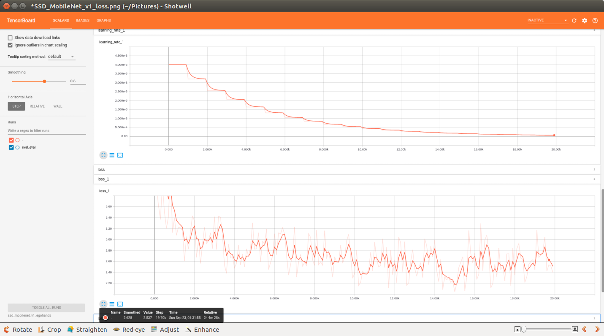
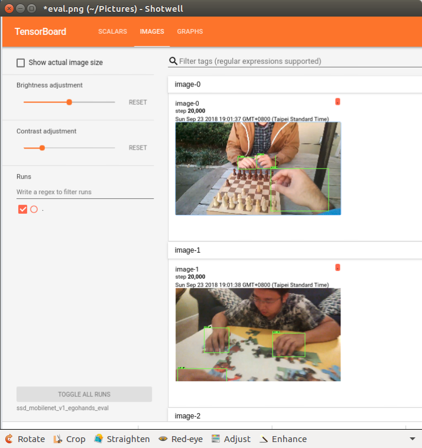

Hand Detection Tutorial
=======================

This is a tutorial on how to train a 'hand detector' with TensorFlow object detection API.  This README outlines how to set up everything and train the object detection model locally.  You could refer to the following blog post for more detailed description about the steps within.

* [Training a Hand Detector with TensorFlow Object Detection API](https://jkjung-avt.github.io/hand-detection-tutorial/)
* [Adapting the Hand Detector Tutorial to Your Own Data](https://jkjung-avt.github.io/object-detection-tutorial/)

Table of contents
-----------------

* [Setup](#setup)
* [Training](#training)
* [Evaluating the trained model](#evluating)


<a name="setup"></a>
Setup
-----

Just for reference, the code in this repository has been tested on a desktop PC with:

* NVIDIA GeForce GTX-1080Ti
* Ubuntu 16.04.5 LTS (x86_64)
* CUDA 9.2
* cuDNN 7.1.4
* TensorFlow 1.10.0

Follow the steps below to set up the environment for training tensorflow object detection models.  Make sure tensorflow-gpu and matplotlib (python3 packages) have been installed on the system already.

1. Clone this repository.

   ```shell
   $ cd ~/project
   $ git clone https://github.com/jkjung-avt/hand-detection-tutorial.git
   $ cd hand-detection-tutorial
   ```

2. Run the installation script.  Make sure the last step in the script, `Running model_builder_test.py`, finishes without error, before continuing on.

   ```shell
   $ ./install.sh
   ```
 
   If you are having trouble with the `sudo $PIP install -U xxx` commands in this script, you can replace them with `$PIP install --user -U xxx`.

3. Download pretrained models from tensorflow object detection model zoo.

   ```shell
   $ ./download_pretrained_models.sh
   ```

<a name="training"></a>
Training
--------

1. Prepare the 'egohands' dataset.

   ```shell
   $ python3 prepare_egohands.py
   ```

   The `prepare_egohands.py` script downloads the 'egohands' dataset and convert its annotations to KITTI format.  When finished, the following files should be present in the folder.  Note there are totally 4,800 jpg images in the 'egohands' dataset.

   ```
   ./egohands_data.zip
   ./egohands
     ├── (egohands dataset unzipped)
     └── ......
   ./egohands_kitti_formatted
     ├── images
     │   ├── CARDS_COURTYARD_B_T_frame_0011.jpg
     │   ├── ......
     │   └── PUZZLE_OFFICE_T_S_frame_2697.jpg
     └── labels
         ├── CARDS_COURTYARD_B_T_frame_0011.txt
         ├── ......
         └── PUZZLE_OFFICE_T_S_frame_2697.txt
   ```

2. Create the TFRecord files (train/val) needed to train the object detection model.  The `create_tfrecords.py` script would split the jpg images into 'train' (4,300) and 'val' (500) sets, and then generate `data/egohands_train.tfrecord` and `data/egohands_val.tfrecord`.  This process might take a few minutes.  The resulting TFRecord files are roughly 1.1GB and 132MB in size.

   ```shell
   $ ./create_tfrecords.sh
   ```

3. (Optional) Review and modify the model config file if necessary.  For example, open the file `configs/ssd_mobilenet_v1_egohands.config` with an editor and do some editing.

4. Start training the model by invoking `./train.sh <model_name>`.  For example, to train the detector based on ssd_mobilenet_v1.  Do this:

   ```shell
   $ ./train.sh ssd_mobilenet_v1_egohands
   ```

   The training is set to run for 20,000 iterations.  It takes roughly 2 hours to finish on the desktop PC listed above.

   If you have multiple GPUs, you could specify which GPU to use for the training with the [`CUDA_VISIBLE_DEVICES`](https://www.tensorflow.org/guide/using_gpu) environment variable.  For example, the following command starts a training session for the `faster_rcnn_inception_v2_egohands` model on the 2nd GPU (GPU #1).

   ```shell
   $ CUDA_VISIBLE_DEVICES=1 ./train.sh faster_rcnn_inception_v2_egohands
   ```

5. Monitor the progress of training with TensorBoard, by executing `tensorboard` in another terminal.

   ```shell
   $ cd ~/project/hand-detection-tutorial
   $ tensorboard --logdir=ssd_mobilenet_v1_egohands
   ```

   Then open `http://localhost:6006` with a browser locally.  (You could also replace `localhost` with IP address of the training PC, and do the monitoring remotely.)

   <p>
   
   </p> 


<a name="evaluating"></a>
Evaluating the trained model
----------------------------

* The trained model could be evaluated by simply executing the `./eval.sh` script.  For example,

  ```shell
  # similar to train.sh, use 'CUDA_VISIBLE_DEVICES' to specify GPU
  $ ./eval.sh ssd_mobilenet_v1_egohands
  ```

  Here's an example output of the evaluation output.  Among all the numbers, the author would pay most attention to the 'AP @ IoU=0.50' value (0.967).

  ```
    Average Precision  (AP) @[ IoU=0.50:0.95 | area=   all | maxDets=100 ] = 0.681
    Average Precision  (AP) @[ IoU=0.50      | area=   all | maxDets=100 ] = 0.967
    Average Precision  (AP) @[ IoU=0.75      | area=   all | maxDets=100 ] = 0.809
    Average Precision  (AP) @[ IoU=0.50:0.95 | area= small | maxDets=100 ] = 0.079
    Average Precision  (AP) @[ IoU=0.50:0.95 | area=medium | maxDets=100 ] = 0.313
    Average Precision  (AP) @[ IoU=0.50:0.95 | area= large | maxDets=100 ] = 0.717
    Average Recall     (AR) @[ IoU=0.50:0.95 | area=   all | maxDets=  1 ] = 0.258
    Average Recall     (AR) @[ IoU=0.50:0.95 | area=   all | maxDets= 10 ] = 0.736
    Average Recall     (AR) @[ IoU=0.50:0.95 | area=   all | maxDets=100 ] = 0.742
    Average Recall     (AR) @[ IoU=0.50:0.95 | area= small | maxDets=100 ] = 0.118
    Average Recall     (AR) @[ IoU=0.50:0.95 | area=medium | maxDets=100 ] = 0.466
    Average Recall     (AR) @[ IoU=0.50:0.95 | area= large | maxDets=100 ] = 0.774
  ```

  In addition, you could run `tensorboard` to inspect details of the evaluation.  Note `logdir` points to the 'eval' subdirectory below.

  ```shell
  $ cd ~/project/hand-detection-tutorial
  $ tensorboard --logdir=ssd_mobilenet_v1_egohands_eval
  ```

  Again, open `http://localhost:6006` or `http://<IP.addr>:6006` with a browser.  Click on the 'IMAGES' tab.  You can then browse through all images in the validation set and check how well your trained model performs on those images.

  <p>
  
  </p> 
